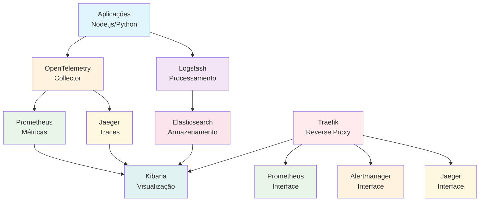
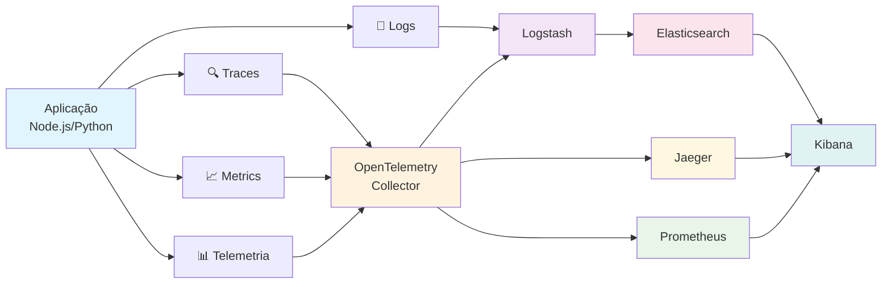
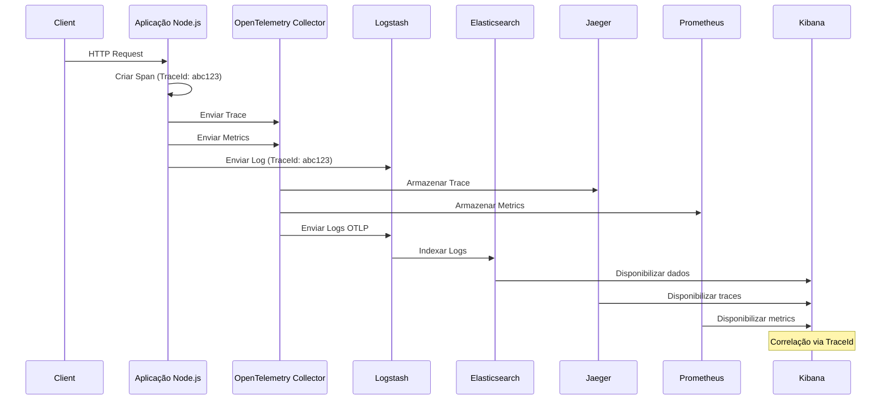
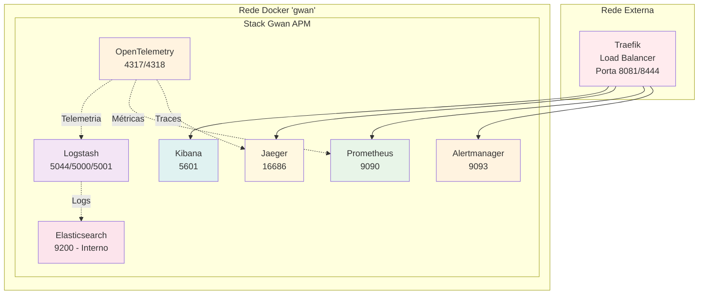

# Gwan APM - Sistema de Observabilidade Completa

Sistema de observabilidade completa para aplicações Node.js e Python rodando no Portainer, utilizando Elasticsearch, Logstash, Kibana, OpenTelemetry, Jaeger e Prometheus para monitoramento, logs e traces distribuídos.

## 🏗️ Arquitetura



## 🔍 Observabilidade Completa

### APM (Application Performance Management)
O sistema evoluiu de um simples sistema de logs para um **APM completo** que oferece:

#### 📊 **Métricas (Metrics)**
- **Contadores**: Total de requisições, erros, operações
- **Histogramas**: Duração de requisições, latência
- **Gauges**: Uso de memória, CPU, conexões ativas
- **Auto-instrumentação**: Métricas automáticas do sistema

#### 🔗 **Traces (Rastreamento Distribuído)**
- **Spans distribuídos**: Rastreamento de requisições entre serviços
- **Contexto distribuído**: Propagação de contexto entre aplicações
- **Latência**: Medição de tempo de resposta
- **Dependências**: Mapeamento de chamadas entre serviços

#### 📝 **Logs Estruturados**
- **Correlação**: Logs vinculados a traces via TraceId/SpanId
- **Formato JSON**: Logs estruturados e padronizados
- **Filtros**: Remoção automática de dados sensíveis
- **Enriquecimento**: Adição de metadados automáticos

### Fluxo de Dados APM



### Sequência de uma Requisição HTTP



### Arquitetura de Rede



## 🌐 **Configuração de Portas e Traefik**

O sistema utiliza o **Traefik existente** no seu servidor para gerenciar o acesso aos serviços através de URLs amigáveis e DNS personalizados.

### 🎯 **Serviços Acessíveis via HTTP (Traefik)**

| Serviço | URL | Porta Externa | Descrição |
|---------|-----|---------------|-----------|
| **Kibana** | `http://kibana.gwan.com.br` | 5602 | Interface de visualização de logs |
| **Jaeger** | `http://jaeger.gwan.com.br` | 16687 | Interface de traces |
| **Prometheus** | `http://prometheus.gwan.com.br` | 9091 | Interface de métricas |
| **Alertmanager** | `http://alertmanager.gwan.com.br` | 9094 | Interface de alertas |

### 🔌 **Serviços para Conexão de Aplicações**

| Serviço | Porta | Protocolo | Descrição |
|---------|-------|-----------|-----------|
| **Logstash** | 5044 | TCP | Filebeat/Logs (Beats) |
| **Logstash** | 5000 | TCP | Logs TCP |
| **Logstash** | 5001 | UDP | Logs UDP |
| **OTEL Collector** | 4317 | gRPC | Telemetria gRPC |
| **OTEL Collector** | 4318 | HTTP | Telemetria HTTP |

### 🔒 **Serviços Internos (Rede Docker)**

| Serviço | Porta | Descrição |
|---------|-------|-----------|
| **Elasticsearch** | 9200 | Armazenamento interno |
| **Logstash** | 9600 | API interna |
| **OTEL Collector** | 8888 | Métricas internas |

## 📋 Pré-requisitos

- Docker e Docker Compose instalados
- Portainer configurado
- Acesso ao servidor (69.62.99.103)
- Aproximadamente 15GB de espaço em disco para logs e telemetria
- Node.js 16+ para aplicações com OpenTelemetry

## 🔌 **Portas em Uso no Servidor**

### **Portas Ocupadas por Outros Serviços**
| Serviço | Porta | Descrição |
|---------|-------|-----------|
| **Traefik Principal** | 80, 443 | Reverse proxy principal |
| **gwan-site** | 8080 | Site principal |
| **Portainer** | 8000, 9000 | Interface de gerenciamento Docker |
| **gwan_bff_api** | 3000 | API Backend |
| **postgres_prod** | 5432 | Banco PostgreSQL principal |
| **pgvector** | 5433 | Banco PostgreSQL com extensão vector |
| **gwan_python_api** | 8001 | API Python |
| **mongodb** | 27017 | Banco MongoDB |
| **gwan_rabbitmq** | 5672, 15672 | Message broker |
| **chatwoot-redis** | 6379 | Cache Redis |
| **n8n** | 5678 | Automação de workflows |

### **Portas do Sistema Gwan APM**
| Serviço | Porta | Descrição |
|---------|-------|-----------|
| **Kibana** | 5602 | Interface de visualização |
| **Jaeger** | 16687 | Interface de traces |
| **Prometheus** | 9091 | Interface de métricas |
| **Alertmanager** | 9094 | Interface de alertas |
| **Logstash** | 5044, 5000, 5001 | Coleta de logs |
| **OTEL Collector** | 4317, 4318 | Telemetria |

## 🚀 Instalação

### 1. Clone o repositório
```bash
git clone https://github.com/seu-usuario/gwan-logs.git
cd gwan-logs
```

### 2. Configure as variáveis de ambiente
```bash
cp .env.example .env
# Edite o arquivo .env com suas configurações
```

### 3. Deploy via Portainer
1. Acesse o Portainer
2. Vá em "Stacks" → "Add stack"
3. Nome: `gwan-logs`
4. Cole o conteúdo do arquivo `docker-compose.yml`
5. Clique em "Deploy the stack"

### 4. Acesse as interfaces
- **📊 Kibana**: `http://kibana.gwan.com.br` (Logs e Visualização)
- **🔍 Jaeger**: `http://jaeger.gwan.com.br` (Traces e Spans)
- **📊 Prometheus**: `http://prometheus.gwan.com.br` (Métricas)
- **🚨 Alertmanager**: `http://alertmanager.gwan.com.br` (Alertas Críticos)

## 📊 Monitoramento e Alertas

### Alertas Configurados
O sistema monitora apenas alertas críticos de disponibilidade:

- **Elasticsearch Down**: Serviço de armazenamento indisponível
- **Kibana Down**: Interface de visualização indisponível  
- **Prometheus Down**: Coletor de métricas indisponível
- **OpenTelemetry Collector Down**: Coletor de telemetria indisponível

### Métricas Disponíveis
- **Aplicação**: Requisições, erros, latência (via Prometheus)
- **Sistema**: Health checks dos serviços
- **Logs**: Análise completa via Kibana
- **Traces**: Rastreamento distribuído via Jaeger

## 🔧 Configuração das Aplicações

### Para aplicações Node.js com OpenTelemetry

#### 1. Instalar dependências
```bash
npm install @opentelemetry/sdk-node @opentelemetry/auto-instrumentations-node @opentelemetry/exporter-trace-otlp-http @opentelemetry/exporter-metrics-otlp-http winston winston-elasticsearch
```

#### 2. Configurar OpenTelemetry
```javascript
const { NodeSDK } = require('@opentelemetry/sdk-node');
const { getNodeAutoInstrumentations } = require('@opentelemetry/auto-instrumentations-node');
const { OTLPTraceExporter } = require('@opentelemetry/exporter-trace-otlp-http');
const { OTLPMetricExporter } = require('@opentelemetry/exporter-metrics-otlp-http');
const { Resource } = require('@opentelemetry/resources');
const { SemanticResourceAttributes } = require('@opentelemetry/semantic-conventions');
const { PeriodicExportingMetricReader } = require('@opentelemetry/sdk-metrics');

// Configuração do OpenTelemetry
const sdk = new NodeSDK({
  resource: new Resource({
    [SemanticResourceAttributes.SERVICE_NAME]: 'minha-app',
    [SemanticResourceAttributes.SERVICE_VERSION]: '1.0.0',
    environment: 'production',
  }),
  traceExporter: new OTLPTraceExporter({
    url: 'http://gwan.com.br:4318/v1/traces',
  }),
  metricReader: new PeriodicExportingMetricReader({
    exporter: new OTLPMetricExporter({
      url: 'http://gwan.com.br:4318/v1/metrics',
    }),
    exportIntervalMillis: 1000,
  }),
  instrumentations: [getNodeAutoInstrumentations()],
});

// Inicializa o SDK
sdk.start();
```

#### 3. Configurar Logger com Winston
```javascript
const winston = require('winston');
const { ElasticsearchTransport } = require('winston-elasticsearch');
const { trace } = require('@opentelemetry/api');

const logger = winston.createLogger({
  level: 'info',
  format: winston.format.combine(
    winston.format.timestamp(),
    winston.format.json()
  ),
  transports: [
    new winston.transports.Console(),
    new ElasticsearchTransport({
      level: 'info',
      clientOpts: {
        node: 'http://gwan.com.br:9200',
        index: 'gwan-logs'
      }
    })
  ]
});

// Middleware para Express com OpenTelemetry
const loggerMiddleware = (req, res, next) => {
  const start = Date.now();
  const tracer = trace.getTracer('minha-app');
  
  const span = tracer.startSpan('http-request', {
    attributes: {
      'http.method': req.method,
      'http.url': req.url,
      'http.user_agent': req.get('User-Agent'),
    }
  });
  
  res.on('finish', () => {
    const duration = Date.now() - start;
    
    span.setAttributes({
      'http.status_code': res.statusCode,
      'http.response_size': res.get('Content-Length'),
    });
    
    logger.info('HTTP Request', {
      method: req.method,
      url: req.url,
      status: res.statusCode,
      duration: `${duration}ms`,
      traceId: span.spanContext().traceId,
      spanId: span.spanContext().spanId,
    });
    
    span.end();
  });
  
  next();
};
```

### Para aplicações Python com OpenTelemetry

#### 1. Instalar dependências
```bash
pip install opentelemetry-api opentelemetry-sdk opentelemetry-instrumentation-flask opentelemetry-exporter-otlp-proto-http python-json-logger elasticsearch
```

#### 2. Configurar OpenTelemetry
```python
from opentelemetry import trace
from opentelemetry.sdk.trace import TracerProvider
from opentelemetry.sdk.trace.export import BatchSpanProcessor
from opentelemetry.exporter.otlp.proto.http.trace_exporter import OTLPSpanExporter
from opentelemetry.sdk.resources import Resource
from opentelemetry.instrumentation.flask import FlaskInstrumentor

# Configurar o provider de traces
resource = Resource.create({"service.name": "minha-app", "service.version": "1.0.0"})
trace.set_tracer_provider(TracerProvider(resource=resource))

# Configurar o exportador
otlp_exporter = OTLPSpanExporter(endpoint="http://gwan.com.br:4318/v1/traces")
span_processor = BatchSpanProcessor(otlp_exporter)
trace.get_tracer_provider().add_span_processor(span_processor)

# Instrumentar Flask
FlaskInstrumentor().instrument()
```

### Para envio de logs via Filebeat

#### 1. Configurar Filebeat
```yaml
# filebeat.yml
filebeat.inputs:
- type: log
  enabled: true
  paths:
    - /var/log/application/*.log
  json.keys_under_root: true
  json.add_error_key: true

output.logstash:
  hosts: ["gwan.com.br:5044"]

processors:
  - add_host_metadata: ~
  - add_cloud_metadata: ~
```

#### 2. Enviar logs via TCP/UDP
```javascript
// Node.js - Enviar logs via TCP
const net = require('net');

const client = new net.Socket();
client.connect(5000, 'gwan.com.br', () => {
  console.log('Conectado ao Logstash');
});

client.write(JSON.stringify({
  level: 'info',
  message: 'Log via TCP',
  timestamp: new Date().toISOString(),
  service: 'minha-app'
}));
```

```python
# Python - Enviar logs via UDP
import socket
import json

sock = socket.socket(socket.AF_INET, socket.SOCK_DGRAM)
log_data = {
    'level': 'info',
    'message': 'Log via UDP',
    'timestamp': '2024-01-01T00:00:00Z',
    'service': 'minha-app'
}
sock.sendto(json.dumps(log_data).encode(), ('gwan.com.br', 5001))
```

## 📊 Visualização de Dados

### Kibana - Interface Principal
- **Discover**: Pesquisa e análise de logs
- **Dashboards**: Visualizações customizadas
- **Index Patterns**: Configuração de índices
- **Alertas**: Configuração de alertas baseados em logs
- **Métricas**: Visualizações de performance

### Jaeger - Distributed Tracing
- **Search**: Busca de traces por serviço, operação, tags
- **Trace View**: Visualização detalhada de traces
- **Dependencies**: Mapa de dependências entre serviços
- **Metrics**: Métricas de latência e throughput

### Prometheus - Métricas Básicas
- **Time-series**: Dados históricos de performance
- **Query Language**: PromQL para consultas avançadas
- **Alertas**: Alertas críticos de disponibilidade
- **Health Checks**: Status dos serviços

### Alertmanager - Gestão de Alertas
- **Agrupamento**: Agrupa alertas similares
- **Supressão**: Suprime alertas menores quando há problemas críticos
- **Notificações**: Distribui alertas pelos canais configurados

## 🔒 Segurança

- **Autenticação**: Credenciais configuráveis
- **TLS/SSL**: Suporte a HTTPS
- **Filtros**: Remoção automática de dados sensíveis
- **Isolamento**: Rede Docker isolada
- **Backup**: Backup automático dos dados

## 📈 Escalabilidade

O sistema APM foi projetado para:
- **Aplicações**: Suportar até 100 aplicações simultâneas
- **Logs**: Processar 50.000 logs por minuto
- **Traces**: Rastrear 10.000 traces por minuto
- **Métricas**: Coletar 1.000 métricas por segundo
- **Armazenamento**: 90 dias de retenção configurável
- **Backup**: Backup automático diário
- **Performance**: Latência < 100ms para consultas
- **Disponibilidade**: 99.9% uptime

## 🛠️ Manutenção

### Backup
```bash
# Backup do Elasticsearch
docker exec gwan-elasticsearch elasticsearch-dump --input=http://localhost:9200/gwan-logs --output=backup-logs.json

# Backup das configurações
docker cp gwan-otel-collector:/etc/otel-collector-config.yaml ./backup/otel-config.yaml
```

### Limpeza de Dados Antigos
Configure políticas de retenção:
- **Logs**: 30-90 dias (configurável)
- **Traces**: 7-30 dias (configurável)
- **Métricas**: 90-365 dias (configurável)

### Monitoramento do Sistema
- **CPU**: < 80% por container
- **Memória**: < 85% por container
- **Disco**: < 90% total
- **Rede**: < 1Gbps por serviço

## 🐛 Troubleshooting

### Problemas Comuns

#### 1. OpenTelemetry Collector não inicia
```bash
# Verificar logs
docker logs gwan-otel-collector

# Verificar configuração
docker exec gwan-otel-collector cat /etc/otel-collector-config.yaml

# Verificar conectividade
curl http://localhost:4318/health
```

#### 2. Traces não aparecem no Jaeger
```bash
# Verificar se o Collector está recebendo dados
curl http://localhost:4318/v1/traces

# Verificar conectividade com Jaeger
curl http://jaeger:16686/api/services

# Verificar configuração OTLP
docker logs gwan-jaeger
```

#### 3. Métricas não são coletadas
```bash
# Verificar endpoint de métricas
curl http://localhost:8888/metrics

# Verificar configuração do Prometheus
docker logs gwan-prometheus

# Verificar targets no Prometheus
curl http://localhost:9090/api/v1/targets

# Verificar conectividade da aplicação
telnet localhost 4318
```

#### 4. Prometheus sem dados
```bash
# Verificar status do Prometheus
curl http://localhost:9090/-/healthy

# Verificar targets
curl http://localhost:9090/api/v1/targets

# Verificar configuração
docker exec gwan-prometheus cat /etc/prometheus/prometheus.yml

# Verificar logs
docker logs gwan-prometheus
```

#### 4. Logs não aparecem no Kibana
```bash
# Verificar Elasticsearch
curl http://localhost:9200/_cluster/health

# Verificar Logstash
docker logs gwan-logstash

# Verificar índices
curl http://localhost:9200/_cat/indices
```

#### 5. Alertmanager não envia alertas
```bash
# Verificar status do Alertmanager
curl http://localhost:9093/-/healthy

# Verificar configuração
docker exec gwan-alertmanager cat /etc/alertmanager/alertmanager.yml

# Verificar logs
docker logs gwan-alertmanager

# Verificar conectividade com Prometheus
curl http://localhost:9090/api/v1/alertmanagers
```

### Logs do Sistema
```bash
# Logs do OpenTelemetry Collector
docker logs gwan-otel-collector

# Logs do Jaeger
docker logs gwan-jaeger

# Logs do Prometheus
docker logs gwan-prometheus

# Logs do Alertmanager
docker logs gwan-alertmanager

# Logs do Elasticsearch
docker logs gwan-elasticsearch

# Logs do Logstash
docker logs gwan-logstash

# Logs do Kibana
docker logs gwan-kibana
```

## 📞 Suporte

Para suporte técnico:
- **GitHub Issues**: [Abrir Issue](link-para-issues)
- **Email**: suporte@gwan.com.br
- **Documentação**: [Wiki do Projeto](link-para-wiki)
- **Telegram**: @gwan_suporte

## 📄 Licença

Este projeto está sob a licença MIT. Veja o arquivo [LICENSE](LICENSE) para mais detalhes.

---

**Desenvolvido para Gwan.com.br** 🚀
