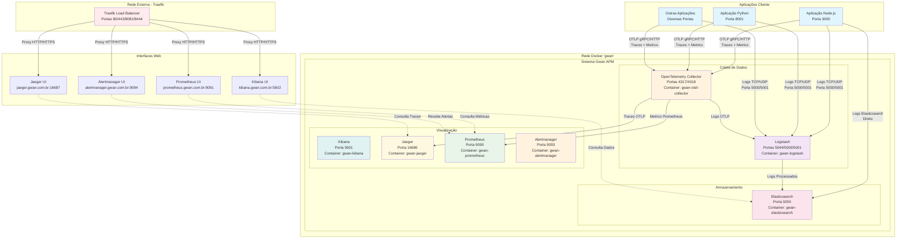
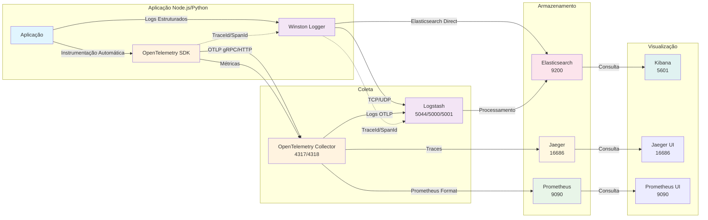
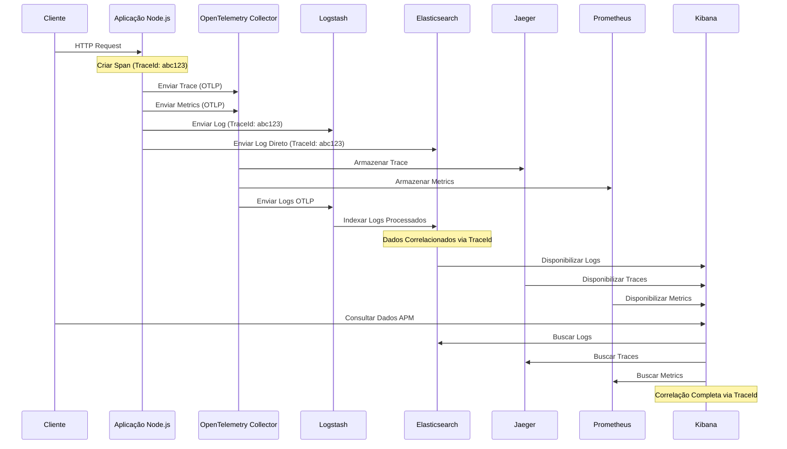
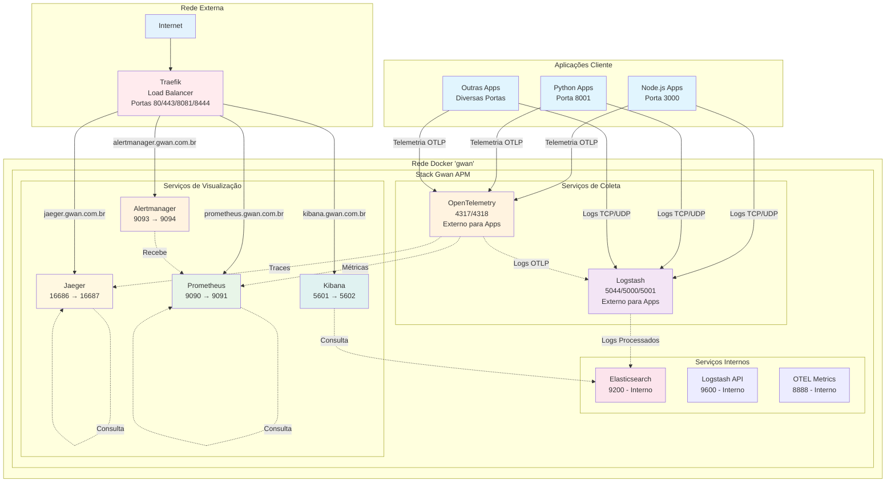
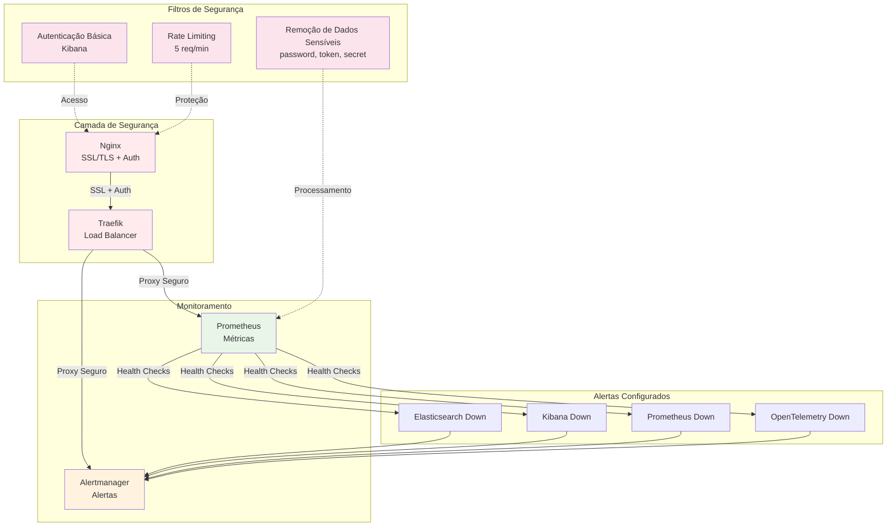
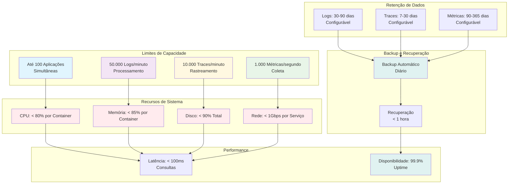
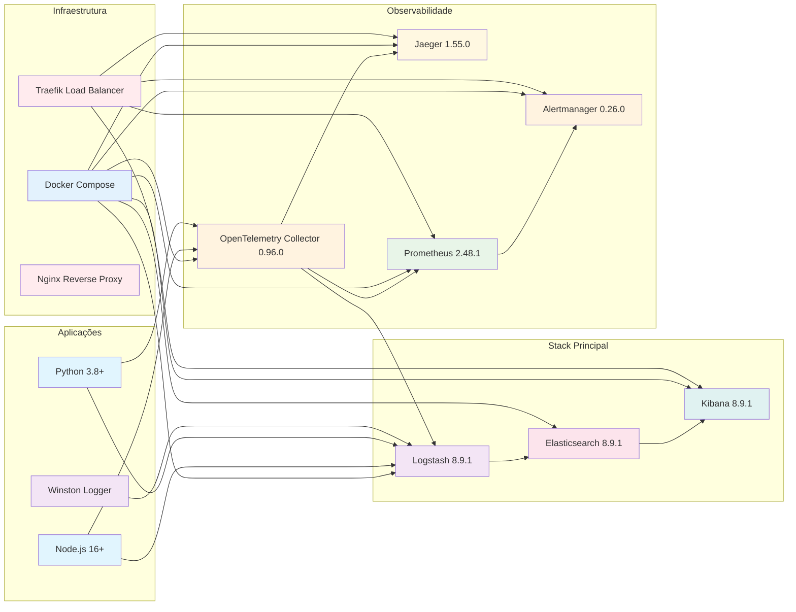

# Arquitetura Detalhada do Sistema Gwan APM

## Diagrama Principal da Arquitetura

## Fluxo Detalhado de Dados APM

## Sequência de uma Requisição HTTP Completa

## Arquitetura de Rede e Portas

## Configuração de Segurança e Monitoramento

## Escalabilidade e Performance

## Tecnologias e Versões

---

**Sistema Gwan APM - Observabilidade Completa** 🚀

Este sistema oferece uma solução completa de observabilidade com logs estruturados, traces distribuídos e métricas de performance, tudo integrado e correlacionado para facilitar o debugging e monitoramento de aplicações em produção.
